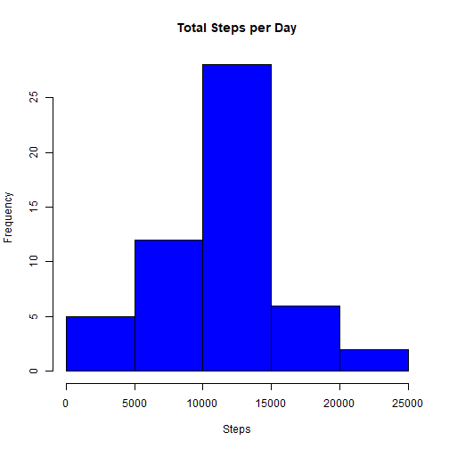
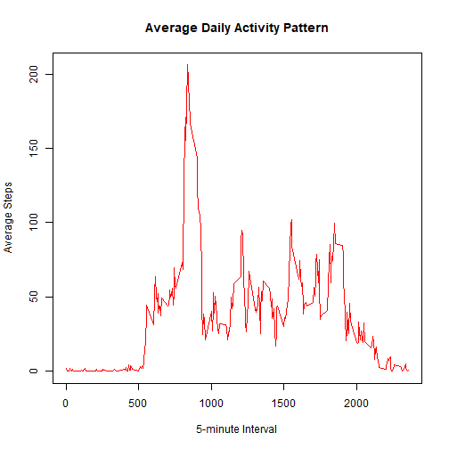
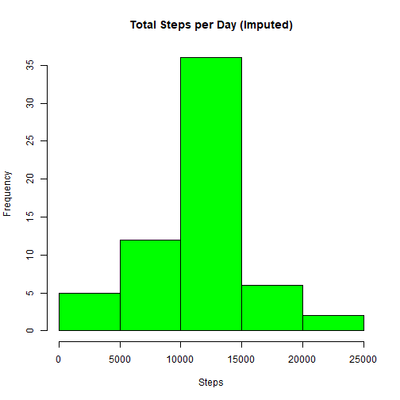
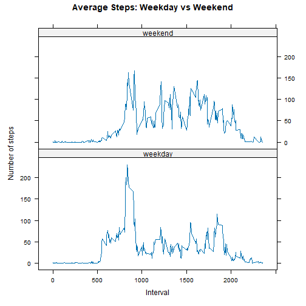

## Loading and preprocessing the data

``` r
# Load the data
if (!file.exists("activity.csv")) {
    unzip("activity.zip")
}
data <- read.csv("activity.csv")

# Process/transform the data
data$date <- as.Date(data$date, format = "%Y-%m-%d")
```

## What is mean total number of steps taken per day?

``` r
# Calculate the total number of steps taken per day
steps_per_day <- aggregate(steps ~ date, data, sum, na.rm = TRUE)

# Make a histogram of the total number of steps taken each day
hist(steps_per_day$steps, main = "Total Steps per Day", xlab = "Steps", col = "blue")
```



``` r
# Calculate and report the mean and median of the total number of steps taken per day
mean_steps <- mean(steps_per_day$steps)
median_steps <- median(steps_per_day$steps)
```
The mean total number of steps taken per day is 1.0766189 &times; 10<sup>4</sup>.
The median total number of steps taken per day is 10765.

## What is the average daily activity pattern?

``` r
# Time series plot of the 5-minute interval and the average number of steps taken
avg_steps_per_interval <- aggregate(steps ~ interval, data, mean, na.rm = TRUE)
plot(avg_steps_per_interval$interval, avg_steps_per_interval$steps, type = "l", 
     main = "Average Daily Activity Pattern", xlab = "5-minute Interval", ylab = "Average Steps", col = "red")
```



``` r
# Which 5-minute interval contains the maximum number of steps?
max_interval <- avg_steps_per_interval$interval[which.max(avg_steps_per_interval$steps)]
```
The 5-minute interval that, on average, contains the maximum number of steps is 835.

## Imputing missing values

``` r
# Calculate and report the total number of missing values
num_na <- sum(is.na(data$steps))
```
The total number of missing values in the dataset is 2304.


``` r
# Strategy for filling in all of the missing values: use the mean for that 5-minute interval
imputed_data <- data
for (i in 1:nrow(imputed_data)) {
    if (is.na(imputed_data$steps[i])) {
        interval_val <- imputed_data$interval[i]
        imputed_data$steps[i] <- avg_steps_per_interval$steps[avg_steps_per_interval$interval == interval_val]
    }
}

# Histogram of the total number of steps taken each day after missing values are imputed
steps_per_day_imputed <- aggregate(steps ~ date, imputed_data, sum)
hist(steps_per_day_imputed$steps, main = "Total Steps per Day (Imputed)", xlab = "Steps", col = "green")
```



``` r
# Calculate and report the mean and median total number of steps taken per day
mean_steps_imputed <- mean(steps_per_day_imputed$steps)
median_steps_imputed <- median(steps_per_day_imputed$steps)
```
After imputing missing values:
The mean total number of steps taken per day is 1.0766189 &times; 10<sup>4</sup>.
The median total number of steps taken per day is 1.0766189 &times; 10<sup>4</sup>.

The impact of imputing missing data on the estimates of the total daily number of steps is minimal in this case, as we used the interval means which tends to preserve the overall distribution.

## Are there differences in activity patterns between weekdays and weekends?

``` r
# Create a new factor variable "day_type"
imputed_data$day_type <- ifelse(weekdays(imputed_data$date) %in% c("Saturday", "Sunday"), "weekend", "weekday")
imputed_data$day_type <- as.factor(imputed_data$day_type)

# Panel plot comparing the average number of steps taken per 5-minute interval across weekdays and weekends
avg_steps_day_type <- aggregate(steps ~ interval + day_type, imputed_data, mean)

library(lattice)
xyplot(steps ~ interval | day_type, data = avg_steps_day_type, layout = c(1, 2), type = "l",
       main = "Average Steps: Weekday vs Weekend", xlab = "Interval", ylab = "Number of steps")
```


